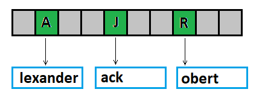
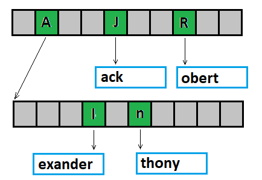

# The radix-tree storage
An associative container as a container is a memory which holds a data. It is called associative because the index used for addressing can be any sequence of bytes, a string for example.
It is mostly known as a key of couse.

But let's think about this like it is a real index, and it's just a ordinary container.

So, it is strange to use 100 or more bytes value like the index. First of all it would be a lot of free space into the container, because usually we don't have keys values following each other like "1 - 2 - 3 - ..." sequence. And also we don't have such a big memory.

But let's just imagine it. Something like this, where green is the storage element, gray is the allocated memory with no actual data:

So, we can think about the key like it is an index but we can't use it in that way.

But the key or the index or the string or anything is just a sequence of bytes. Each byte can be a separate index in the separate table. One byte is just 256 elements in this table.
Can we afford 256 elements table? Sure. The new problem is the number of these tables. So, we a here now:

A lot of tables, and mostly of them are not used. And it is the huge difference with the previous picture. Most of the unused memory is now collected in tables.
Now it is possible not to allocate empty tables.

Ok, this saves space but increases the number of indexes. There are 100 indexes for 100 bytes key. But is it necessary to use all indexes?
Let see an example. There are three elements with keys: "Robert", "Alexander", "Jack". How many tables do we need to store these three elements? Just one:

The blue color shows where the value of the element and the rest of the key are stored.
With one more elements "Anthony":

And one more - "Andrew"

I think the idea is clear.
To be honest, I use a 4-bit key because it requires only 16 elements in additional tables instead of 256 elements in the case of an 8-bit key.

The pointer that is held in this additional table can be a pointer to the next same table or a pointer to "real data".
In radix_storage.hpp they are represented as radix_tree class and radix_element class respectively. radix_element is base class for radix_tree, this allows us to recognize what the pointer is pointing to using the dynamic_cast<> conversion.

TEST 

main.cpp is a test program. There is a comparison with std::map and std::unordered_map containers.

space

Yes, the base tree requires additional memory. This is about 100 bytes for one element, regardless of how long the key is and how large the number of elements is.

speed

As for the speed, it's not that bad)
In fact, std::map is too slow to be a competitor.
The radix tree (I mean this implementation) is similar with std::unordered_map.
std::unordered_map gets faster than the radix tree when the number of elements exceeds several million

100'000 elements:
operation (ms) | insert | access | erase
--- | --- | --- | ---
std::map | 133 | 105 | 139 
std::unordered_map | 48 | 23 | 32 
Radix tree | 37 | 14 | 23

1'000'000 elements:
operation (ms) | insert | access | erase
--- | --- | --- | ---
std::map | 1898 | 1599 | 2219 
std::unordered_map | 684 | 333 | 451 
Radix tree | 503 | 275 | 361

5'000'000 elements:
operation (ms) | insert | access | erase
--- | --- | --- | ---
std::map | 15703 | 11865 | 14751 
std::unordered_map | 4078 | 2222 | 2712 
Radix tree | 3905 | 2433 | 2855

10'000'000 elements:
operation (ms) | insert | access | erase
--- | --- | --- | ---
std::unordered_map | 9273 | 4389 | 5743 
Radix tree | 7960 | 4730 | 5656
